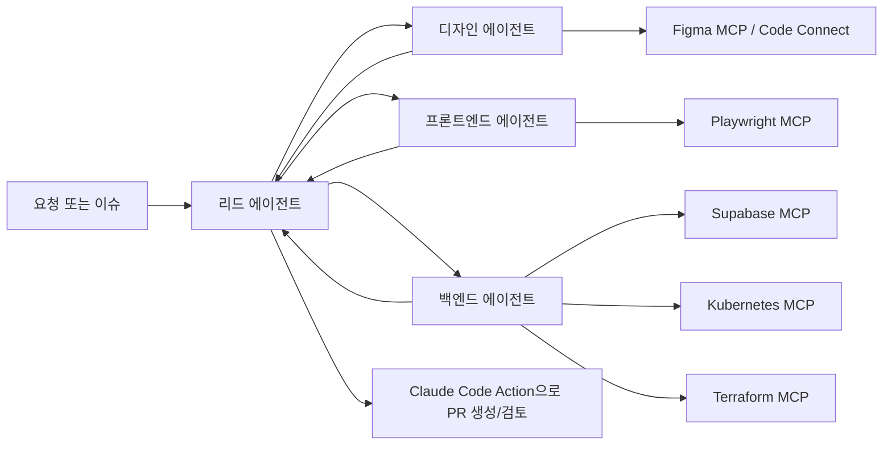
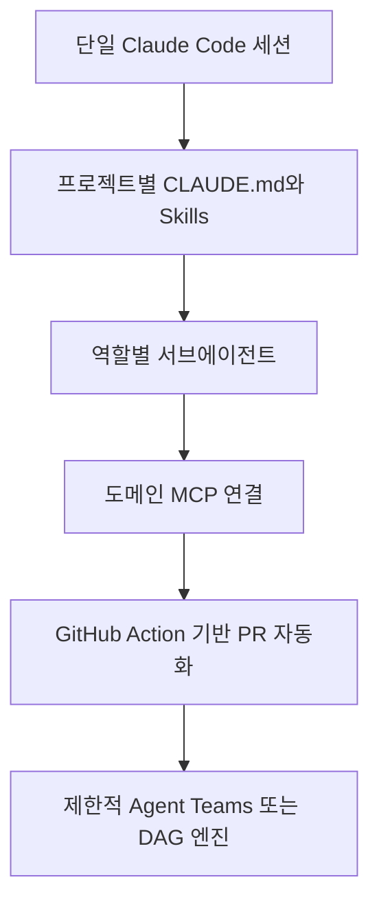

# 2026년 봄 기준 Claude 기반 AI 에이전트 팀 구축을 위한 GitHub 리서치 보고서

## 경영진 요약

2026년 4월부터 5월까지의 공개 업데이트를 기준으로 보면, **Claude 기반 전문 에이전트 팀을 실제 제품 개발 조직에 도입하는 가장 현실적인 경로는 `Claude Code`를 중심으로 `Agent SDK`, `Skills`, `Claude Code Action`, 그리고 도메인별 MCP 서버를 조합하는 방식**입니다. Anthropic은 이 기간까지 공식 문서와 저장소를 통해 서브에이전트, 에이전트 팀, Agent SDK, 플러그인 마켓플레이스, GitHub Actions, MCP 연동, 훅, 세션 지속성까지 상당히 넓은 운영면을 공개했고, 특히 서브에이전트와 Skills는 프로젝트·사용자·플러그인 범위에서 재사용 가능하도록 정리돼 있어 팀 단위 표준화에 적합합니다. 다만 **Agent Teams는 여전히 실험적 기능**이며, 토큰 비용과 세션/종료 동작의 한계가 공식 문서에 명시돼 있으므로, 곧바로 “완전 자율 멀티에이전트 팀”으로 가기보다 **서브에이전트 + Skills + MCP**부터 시작하는 것이 안전합니다. citeturn11search0turn11search1turn13search1turn10search0turn15search0

카테고리별로는, **디자인 팀은 `open-design` + `figma-console-mcp` + `figma/code-connect` 조합**, **프론트엔드 팀은 `Claude Code` 또는 Agent SDK 위에 `microsoft/playwright-mcp`와 Figma 연계 레이어를 결합한 구조**, **백엔드 팀은 `Supabase MCP`, `Kubernetes MCP Server`, `Terraform MCP Server` 같은 운영 도구형 MCP를 Claude 런타임에 연결하는 구조**가 가장 설득력이 높았습니다. 디자인 영역은 로컬-퍼스트 아티팩트 생성과 디자인 시스템/토큰 동기화가 빠르게 진화하고 있고, 프론트엔드는 브라우저 자동화·접근성 스냅샷·LSP/Code Connect가 사실상 핵심이며, 백엔드는 데이터베이스·인프라·클러스터 접근을 MCP로 노출하되 범위 제한과 승인 모델을 강하게 설계하는 것이 중요합니다. citeturn33search0turn33search1turn25search0turn30search0turn4search0turn4search1turn26search1turn26search0turn7search0

가장 중요한 결론은, **2026년 5월 시점의 Claude 생태계는 “특화 역할을 가진 에이전트 팀”을 만들 수 있을 만큼 충분히 성숙했지만, 그 성숙도는 영역별로 다르다**는 점입니다. 코딩/오케스트레이션 기반은 공식 Anthropic 스택이 가장 안정적이고, 디자인은 오픈소스 혁신 속도가 가장 빠르며, 운영/백엔드 MCP는 강력하지만 보안 리스크가 큽니다. 따라서 실제 도입은 **공식 런타임 → 역할별 서브에이전트 → 도메인 MCP → GitHub CI/CD → 제한적 에이전트 팀** 순으로 점진 적용하는 편이 권장됩니다. citeturn1search0turn16search0turn16search1turn17search2turn23search0turn18search0turn28academia36turn28academia42

## 조사 범위와 선별 원칙

이번 조사는 **사용 환경, 규모, Claude API 버전이 특정되지 않았다는 가정** 아래, GitHub 공개 저장소와 공식 문서를 우선으로 선별했습니다. 직접 URL을 장문으로 나열하는 대신, **저장소 슬러그와 인용 링크**를 함께 제공해 원문 GitHub 페이지나 공식 문서로 바로 이동할 수 있게 구성했습니다. 최신성은 가능한 한 **2026년 4월~5월의 릴리스, changelog, 이슈/PR 활동, GitHub의 “Updated” 표시**를 우선 사용했고, 이 기간의 확실한 활동이 보이지 않는 저장소는 **“최신 확인 가능한 공개 릴리스/문서” 기준**으로 표시했습니다. 이는 특히 인프라/MCP 계열 저장소에서 유효합니다. citeturn13search0turn16search2turn17search0turn27search2turn28search0

아래 표는 실제로 참고 가치가 높은 핵심 저장소만 추린 **우선순위 포트폴리오**입니다. Anthropic 공식 저장소, Figma·Microsoft·Supabase·HashiCorp·containers.org 같은 1차 공급자 저장소, 그리고 최근 4~5월에 빠르게 커뮤니티 신호를 만든 `open-design`, `open-multi-agent`, `harness` 같은 상위 오픈소스를 포함했습니다. citeturn1search2turn33search2turn18search0turn23search0

| 분류 | 저장소 | 라이선스 또는 이용조건 | 최신 확인 가능한 업데이트 | 2026-04~05 활동 | 비고 |
|---|---|---|---|---|---|
| 공식 런타임 | `anthropics/claude-code` citeturn1search0turn1search2turn13search0 | 저장소에 `LICENSE.md` 존재, 상세 라이선스 표기는 인덱싱 스니펫상 제한적 | GitHub 조직 목록 기준 2026-05-27 업데이트, changelog는 2026-04 다수 항목 공개 | 매우 활발 | Claude-native 기본 런타임 |
| 공식 SDK | `anthropics/claude-agent-sdk-python` citeturn16search0turn16search3 | MIT + Commercial Terms 병행 | v0.2.87, 2026-05-23 | 활발 | Python 백엔드 임베딩용 |
| 공식 SDK | `anthropics/claude-agent-sdk-typescript` citeturn16search1turn16search2 | 저장소 표시상 오픈소스 공개, Commercial Terms 병행 | v0.3.156, 2026-05-29 | 활발 | TypeScript 서비스 임베딩용 |
| CI/CD | `anthropics/claude-code-action` citeturn1search3turn17search0turn17search2 | 저장소 라이선스 표기는 스니펫 제한, v1 릴리스 공개 | v1.0.133, 2026-05-23 / 조직 목록 기준 2026-05-27 업데이트 | 활발 | PR/Issue 자동화 |
| 역할 표준화 | `anthropics/skills` citeturn9search0turn9search3turn15search0 | 혼합: 다수 Apache-2.0, 일부 source-available | GitHub topics 기준 2026-05-19 업데이트 | 활발 | Skills 표준의 실전 레퍼런스 |
| 플러그인 유통 | `anthropics/claude-plugins-official` citeturn9search2turn14search0 | Anthropic 관리 공식 디렉터리 | 조직 목록 기준 2026-05-27 업데이트 | 활발 | LSP·GitHub·도구 확장 |
| 디자인 | `nexu-io/open-design` citeturn33search0turn33search1turn33search2 | Apache-2.0 | 2026-05-27 업데이트 / 0.8.0 릴리스 2026-05-22 | 매우 활발 | Claude Design 대안 |
| 디자인 | `southleft/figma-console-mcp` citeturn25search0 | MIT | v1.29.0, 2026-05-22 | 활발 | Figma 추출·생성·토큰 동기화 |
| 디자인-개발 브리지 | `figma/code-connect` citeturn30search0turn30search7 | MIT | Code Connect 1.4.5, 2026-05-13 | 활발 | Dev Mode에서 실코드 매핑 |
| 프론트엔드 테스트 | `microsoft/playwright-mcp` citeturn4search0turn4search6 | Apache-2.0 | v0.0.75, 2026-05-07 | 활발 | 브라우저 자동화·접근성 스냅샷 |
| 백엔드 DB | `supabase-community/supabase-mcp` citeturn26search1turn27search0turn27search5 | Apache-2.0 | v0.8.1, 2026-05-01 | 활발 | Supabase 프로젝트/DB 도구 |
| 백엔드 클러스터 | `containers/kubernetes-mcp-server` citeturn26search0turn27search2turn27search3turn27search7 | Apache-2.0 | 2026-05-28 업데이트 / v0.0.62 릴리스 2026-05-05 | 매우 활발 | Kubernetes/OpenShift 운영 |
| 백엔드 IaC | `hashicorp/terraform-mcp-server` citeturn7search0turn7search1turn28search0turn26search4 | MPL-2.0 | 최신 확인 가능한 공개 릴리스 v0.3.3, 2025-11-21 | 2026-04~05 명시적 릴리스는 미확인 | Terraform/HCP 연동 |
| 오케스트레이션 | `open-multi-agent/open-multi-agent` citeturn18search0turn31search0 | MIT | v1.4.0, 2026-05-09 | 활발 | TypeScript DAG 오케스트레이션 |
| 메타 오케스트레이션 | `revfactory/harness` citeturn23search0 | Apache-2.0 | 저장소 README 기준 최근 28 commits, 2026-05 초 활동 공개 | 활발 | 팀 구조를 생성하는 “팩토리” |

보조 후보로는 `generalaction/emdash`(병렬 git worktree 기반 ADE, 2026-05-26 릴리스)와 `arinspunk/claude-talk-to-figma-mcp`(안정 릴리스 2026-04-18)가 있습니다. 이 둘은 각각 **운영 UX**와 **가벼운 Figma 연결성** 측면에서 의미가 있지만, 핵심 아키텍처 기준으로는 위 표의 15개가 더 직접적입니다. citeturn31search1turn25search1

## 디자인 에이전트 인사이트

디자인 영역에서는 2026년 4~5월 사이에 가장 빠르게 움직인 신호가 보입니다. `open-design`은 Claude Design을 대체하는 오픈소스 로컬-퍼스트 설계 도구로 스스로를 포지셔닝하며, **기존 에이전트 CLI를 디자인 엔진으로 사용하고, Skills 기반 디자인 워크플로를 플러그인으로 모듈화**합니다. 5월 한 달 동안 0.2.0부터 0.8.0까지 여러 릴리스를 연속적으로 냈고, 0.8.0 릴리스에서는 “모든 것이 플러그인”인 구조, 작은 코어 엔진, 디자인 시스템/프로토타입/익스포트/Figma까지 플러그인화된 구조를 전면에 내세웠습니다. 또한 `docs/skills-protocol.md`에서 Claude Code의 `SKILL.md` 규약을 그대로 채택하고 디자인 전용 확장을 추가한다고 명시해, Claude 호환성과 디자인 특화성을 동시에 추구합니다. citeturn33search0turn33search1turn33search5turn33search6

반면 **Figma와의 생산 연결**이 필요하면 `figma-console-mcp`와 `figma/code-connect`가 실무적으로 더 중요합니다. `figma-console-mcp`는 2026년 5월 기준 106개 도구, 디자인 시스템 추출, 양방향 토큰 동기화, 스크린샷 캡처, 버전 히스토리, FigJam/Slides, 접근성 검사, 로컬/클라우드/원격 모드를 제공해 “디자인 시스템을 API로 만든다”는 방향이 매우 분명합니다. `figma/code-connect`는 Figma Dev Mode에서 코드 스니펫을 자동 생성물이 아니라 **실제 프로덕션 컴포넌트 코드**와 직접 연결되게 하며, prop/variant 매핑까지 지원합니다. 즉, 전자는 **디자인 생성·추출·토큰 운영**, 후자는 **디자인 시스템과 코드베이스의 정합성**을 책임지는 역할로 보는 편이 정확합니다. citeturn25search0turn30search0turn30search7

가벼운 Figma 연동이 필요할 때 `claude-talk-to-figma-mcp`도 유효합니다. 이 저장소는 Claude Code를 포함한 여러 AI 도구가 Figma 디자인을 읽고 수정할 수 있게 하며, 2026년 4월 18일에 1.0.0 안정 릴리스를 공개했습니다. 다만 기능 폭과 최근 릴리스 페이스에서는 `figma-console-mcp`가 더 공격적으로 발전 중이며, `code-connect`처럼 “디자인 시스템 컴포넌트 스니펫을 코드 소스와 정밀 매핑”하는 기능은 별도 보완이 필요합니다. citeturn25search1turn25search0turn30search0

### 디자인 저장소 비교

| 저장소 | 아키텍처와 핵심 컴포넌트 | 의존성 | 에이전트 역량 | 학습/미세조정 | 프롬프트·템플릿 패턴 | CI/CD·배포 | 보안·프라이버시 |
|---|---|---|---|---|---|---|---|
| `nexu-io/open-design` citeturn33search0turn33search1turn33search5 | 작은 코어 + 플러그인 구조, Skills 프로토콜, 다중 디자인 시스템/익스포트 계층 | 로컬 CLI 에이전트, TypeScript 기반 데스크톱/웹 레이어 | 프로토타입, 슬라이드, 이미지/비디오, HyperFrames, Figma 대체 흐름 | 공개된 fine-tuning 언급 없음. Skills·워크플로 설계 중심 | `SKILL.md` 호환, `DESIGN.md`/디자인 시스템 중심 문맥 | Vercel 배포 가능, 다중 릴리스 반복 | 로컬-퍼스트/BYOK 강조 |
| `southleft/figma-console-mcp` citeturn25search0 | MCP 서버 + Desktop Bridge/WebSocket + Cloud Relay + 토큰/버전/Slides/App UI 계층 | Node/MCP, Figma Desktop/Cloud, 토큰 출력 파이프라인 | 추출, 생성, 토큰 sync, 스크린샷, 접근성, parity 검사 | 없음. 도구·규칙 기반 | README에 예시 프롬프트 다수 포함 | v1.29.0 릴리스, 여러 모드 배포 | `_mcp` 식별자 부여, 다중 Figma MCP 구분, 원격 쓰기 가능성 때문에 권한 설계 중요 |
| `figma/code-connect` citeturn30search0turn30search7 | Figma Dev Mode ↔ 코드 컴포넌트 매핑 계층 | React/React Native/HTML/SwiftUI/Compose/Storybook 등 | 실코드 스니펫 재사용, prop/variant 매핑 | 없음. 매핑/타입 시스템 중심 | 프로젝트 규칙·컴포넌트 소스 매핑 | 1.4.5 릴리스 | 디자인 시스템을 code source-of-truth로 수렴시키는 구조 |
| `arinspunk/claude-talk-to-figma-mcp` citeturn25search1 | 단순 MCP 연동 중심 | Figma API/MCP | 읽기·분석·수정 | 없음 | README/명령 참조 위주 | 1.0.0 안정 릴리스 | 실사용 안정성 강조, Variables 지원은 진행 중 |

디자인 팀에 대한 권장 도입 경로는 명확합니다. **아이데이션·프로토타이핑은 `open-design`, 제품화와 디자인 시스템 정합성은 `figma-console-mcp` + `figma/code-connect`**가 가장 설득력 있는 조합입니다. 즉, “잘 만드는 에이전트”와 “나중에 틀어지지 않게 묶는 인프라”를 분리해야 합니다. citeturn33search0turn25search0turn30search0

## 프론트엔드 에이전트 인사이트

프론트엔드 팀에서는 **컴포넌트 생성보다 검증 루프**가 더 중요합니다. 2026년 봄 기준으로 가장 강한 신호는 `microsoft/playwright-mcp`입니다. 이 서버는 Playwright를 MCP로 노출해 LLM이 웹 페이지를 **스크린샷이 아니라 접근성 트리 기반 구조화 데이터**로 다루게 하며, Claude Code 설치 예시도 공식 README에 제공합니다. 이는 프론트엔드 에이전트가 브라우저 제어·폼 입력·탐색·상호작용 검증을 결정론적으로 수행할 수 있게 해 주고, Vision 모델 의존도를 낮춰 토큰과 안정성을 동시에 개선합니다. 다만 Playwright 측도 이를 **보안 경계로 보지 말아야 한다**고 명시하고 있어, 개발/테스트 환경 격리와 프로필 관리가 필수입니다. citeturn4search0turn4search1turn4search6

프론트엔드 구현 품질을 높이려면 브라우저 자동화만으로는 부족하고, **디자인 컨텍스트와 코드 컨텍스트가 같이 있어야** 합니다. `figma/code-connect`는 Dev Mode에서 실제 코드 컴포넌트를 연결함으로써 에이전트가 “새 컴포넌트를 임의 생성”하는 대신 기존 디자인 시스템 컴포넌트를 재사용하게 만들고, Figma MCP 가이드도 `get_code`, `get_screenshot`, 토큰 참조, 프로젝트 수준 규칙 파일을 조합하라고 권장합니다. 즉, 프론트엔드 에이전트는 “코드 생성기”가 아니라 “디자인 문맥을 읽고, 브라우저에서 검증하고, 기존 컴포넌트 체계를 따르게 하는 구현자”로 설계하는 편이 좋습니다. citeturn29search0turn30search0turn30search7

Claude 쪽 런타임 관점에서는, `Claude Code`와 Agent SDK가 이미 **서브에이전트, hooks, MCP, sessions, worktree, background agents**를 지원하므로 프론트엔드 역할 분리는 무리 없이 구현됩니다. 공식 문서는 서브에이전트를 YAML frontmatter가 있는 Markdown 파일로 정의하고, 도구 집합과 모델, Skills를 별도로 넣을 수 있다고 설명합니다. 따라서 프론트엔드 팀은 최소한 **“UI 구현 에이전트 / 브라우저 테스트 에이전트 / 접근성 검토 에이전트 / 디자인 시스템 준수 에이전트”** 네 역할로 쉽게 쪼갤 수 있습니다. 공식 플러그인 마켓플레이스는 TypeScript LSP 같은 코드 인텔리전스 플러그인도 제공하므로, 정적 진단과 실행 진단을 같이 붙이는 구조가 자연스럽습니다. citeturn32search4turn32search3turn12search1turn14search0turn10search0

### 프론트엔드 저장소 비교

| 저장소 | 아키텍처와 핵심 컴포넌트 | 의존성 | 에이전트 역량 | 학습/미세조정 | 프롬프트·템플릿 패턴 | CI/CD·배포 | 보안·프라이버시 |
|---|---|---|---|---|---|---|---|
| `microsoft/playwright-mcp` citeturn4search0turn4search1turn4search6 | MCP 서버 + Playwright + 접근성 트리 스냅샷 | Node/Playwright | 브라우저 탐색, 클릭, 폼, 스토리지, 테스트 | 없음. 도구 호출 기반 | 내장 템플릿보다는 도구 호출형 | 빠른 릴리스, 다수 클라이언트 지원 | 보안 경계 아님, persistent profile 주의 |
| `figma/code-connect` citeturn30search0turn30search7 | Dev Mode와 코드 컴포넌트 연결 | Figma + 코드베이스 매핑 | 컴포넌트 재사용, prop mapping, snippet fidelity | 없음 | 프로젝트 규칙 파일과 컴포넌트 매핑 | 릴리스 지속 | 디자인 시스템 drift 감소 |
| `anthropics/claude-code` + `anthropics/claude-plugins-official` citeturn1search0turn14search0turn9search2 | CLI/IDE 런타임 + 플러그인/서브에이전트/LSP | Claude Code + 플러그인 | 구현, 리팩터링, 진단, 병렬 작업 | 없음 | `CLAUDE.md`, 서브에이전트 prompt, Skills | GitHub Action과 잘 연결 | 플러그인 신뢰 경고, hooks는 사용자 권한 실행 |

프론트엔드 도입 권고는 단순합니다. **컴포넌트 생성기부터 만들지 말고, “브라우저에서 스스로 확인하는 구현 에이전트”부터 만드십시오.** 실제 조직에서는 디자인-코드 사이의 drift와 QA 비용이 가장 큰 병목인데, `Playwright MCP + Code Connect + Claude 서브에이전트`가 그 지점을 직접 건드립니다. citeturn4search0turn30search0turn10search0

## 백엔드 에이전트 인사이트

백엔드 영역은 MCP 기반 운영도구 연결이 매우 강력하지만, 동시에 가장 위험합니다. `supabase-community/supabase-mcp`는 Claude 등 AI 어시스턴트가 Supabase 프로젝트에 직접 연결돼 **테이블 관리, 설정 조회, 데이터 질의**를 수행할 수 있게 하며, 2026년 5월 1일에 v0.8.1을 릴리스했습니다. 그러나 README가 **pre-1.0**을 명시하고 있고, 5월 이슈에서는 **read-only stdio 모드에서도 mutating tools 노출**, **주기적 재인증**, **MCP 데이터베이스 기능 노출 문제**가 보고됐습니다. 즉, 백엔드 데이터 계층에서 이 저장소는 강력하지만, 프로덕션 권한·세션 수명·읽기/쓰기 분리를 아직 더 단단히 검증해야 합니다. citeturn26search1turn26search2turn27search0turn27search5

클러스터 운영은 `containers/kubernetes-mcp-server`가 가장 강합니다. 이 저장소는 Kubernetes/OpenShift 자원을 대상으로 generic CRUD, Pods, Events, Helm, KubeVirt, Tekton 등으로 넓게 확장되며, Claude Code 전용 시작 가이드와 Helm 차트도 제공합니다. 2026년 5월에는 v0.0.62 릴리스가 있었고, 5월 15일·19일·27일에 열린 PR이 검색 결과에 남아 있어 활동성이 매우 높습니다. 다만 기능이 강력한 만큼 **프로덕션에서는 전용 ServiceAccount와 read-only 접근**을 우선 검토하라는 가이드가 README에 포함되어 있습니다. citeturn26search0turn27search2turn27search3turn27search7

IaC 레이어에서는 `hashicorp/terraform-mcp-server`가 중요합니다. 이 서버는 Terraform Registry API, HCP Terraform/Terraform Enterprise, workspace 작업, stdio와 streamable HTTP 전송을 지원하며, Claude Code에 추가하는 예시도 문서화합니다. 특히 `instructions.md`와 `AGENTS.md` 예시를 제공해, Terraform 코드베이스 자체를 에이전트 친화적으로 만드는 패턴을 보여 준다는 점이 유의미합니다. 다만, 최신 공개 릴리스 검색 결과는 2025년 11월의 v0.3.3이 마지막으로 보였으므로, **2026년 4~5월의 릴리스 가시성은 떨어집니다**. 따라서 “성숙한 아이디어 참고용”으로는 유효하지만, 최신 운영성 판단은 별도 검증이 필요합니다. citeturn7search0turn7search1turn26search3turn26search4turn28search0turn28search1

### 백엔드 저장소 비교

| 저장소 | 아키텍처와 핵심 컴포넌트 | 의존성 | 에이전트 역량 | 학습/미세조정 | 프롬프트·템플릿 패턴 | CI/CD·배포 | 보안·프라이버시 |
|---|---|---|---|---|---|---|---|
| `supabase-community/supabase-mcp` citeturn26search1turn27search0turn27search5 | Supabase 계정/프로젝트/DB 기능을 노출하는 MCP 서버 | Supabase 대시보드/로그인/OAuth | 프로젝트 생성, 설정 조회, DB 관련 작업 | 없음 | README 중심, 기능 그룹별 툴 노출 | v0.8.1 릴리스 | pre-1.0, read-only/재인증 이슈 존재 |
| `containers/kubernetes-mcp-server` citeturn26search0turn27search2turn27search3 | Kubernetes/OpenShift MCP + toolsets + Helm chart | kubeconfig/cluster 접근 | 리소스 CRUD, Pods, Helm, KubeVirt 등 | 없음 | Claude Code 전용 시작 가이드 제공 | Helm chart, 잦은 릴리스/PR | read-only ServiceAccount 권장 |
| `hashicorp/terraform-mcp-server` citeturn7search0turn26search3turn26search4turn28search0 | Terraform Registry/HCP/TFE 연동 MCP 서버, stdio/HTTP 이중 전송 | Docker/Go/TFE 토큰 | Registry 조회, workspace 작업, 문서 탐색 | 없음 | `instructions.md`, `AGENTS.md` 예시 제공 | GitHub Actions·보안 스캔 개선 언급 | 현 단계 local use 권고, 권한/토큰 관리 필수 |

백엔드에서의 추천 채택 방식은 **“DB 에이전트”, “클러스터 에이전트”, “IaC 에이전트”를 별도 권한 경계에 두는 것**입니다. 백엔드 팀을 하나의 만능 에이전트로 만들면 편해 보이지만, 사실상 **권한 폭발**과 **감사 불가능성**을 초래합니다. 대신 각 도구를 별도 MCP 서버로 연결하고, Claude 측에서는 project scope 또는 user scope 설정과 permission mode를 조합하는 것이 안전합니다. citeturn12search1turn12search0turn26search1turn26search0turn7search0

## 크로스팀 오케스트레이션과 비교 평가

크로스팀 오케스트레이션은 크게 **공식 Claude-native 경로**와 **모델 비종속 커뮤니티 경로**로 나뉩니다. 공식 경로의 핵심은 `Claude Code`의 **서브에이전트, experimental Agent Teams, hooks, sessions, worktrees, GitHub Action**입니다. 서브에이전트는 별도 컨텍스트 창과 도구 제한, 기술 스택별 역할 분리에 적합하며, 프로젝트 `.claude/agents/`에 넣어 버전 관리할 수 있습니다. Agent Teams는 팀 리드, 팀원, 공유 task list, mailbox 구조를 제공하지만, **실험적이고 토큰 비용이 크며, worktree로 격리되지 않는다**는 제한이 공식 문서에 그대로 적혀 있습니다. 이것은 디자인-프론트엔드-백엔드를 동시에 만지는 실제 제품 변경에서는 매우 중요합니다. citeturn10search0turn11search0turn11search1turn13search0

커뮤니티 경로에서는 `open-multi-agent`와 `harness`의 역할이 뚜렷합니다. `open-multi-agent`는 TypeScript 백엔드에 바로 끼워 넣을 수 있는 DAG 오케스트레이터로, coordinator가 goal을 task DAG로 쪼개고, agent pool, shared memory, MCP 연결, tracing, dashboard 렌더링을 제공합니다. 즉, **애플리케이션 내부에 멀티에이전트 엔진을 탑재하고 싶은 팀**에게 유리합니다. 반대로 `harness`는 도메인 설명을 넣으면 **에이전트 팀 정의와 Skills를 생성해 주는 메타 팩토리**입니다. Pipeline, Fan-out/Fan-in, Expert Pool, Producer-Reviewer, Supervisor, Hierarchical Delegation의 여섯 패턴을 제공하므로, “우리가 어떤 팀 구조를 채택해야 하는가”를 빠르게 탐색하는 데 유용합니다. citeturn18search0turn31search0turn23search0

운영 도구로서 `emdash`도 참고 가치가 있습니다. 이 도구는 27개의 CLI 에이전트를 병렬로 돌리고, 각 에이전트를 별도 git worktree와 원격 SSH 프로젝트 위에서 운영하는 ADE를 표방합니다. 즉, Claude Code 자체가 아니라 **Claude Code를 포함한 여러 에이전트를 팀처럼 운영하는 데스크톱 실행면**에 가깝습니다. 만약 귀하의 조직이 이미 Claude Code, Codex, Gemini 등을 혼용하고 있다면 오히려 이쪽이 실무 UX에는 더 잘 맞을 수 있습니다. 다만 “Claude-native 표준화” 관점에서는 공식 스택보다 한 단계 바깥 레이어입니다. citeturn18search1turn31search1

### 공식 스택과 커뮤니티 스택의 트레이드오프

| 접근 | 장점 | 약점 | 권장 시점 |
|---|---|---|---|
| `Claude Code` + 서브에이전트 + Skills citeturn10search0turn15search0 | 가장 직접적이고 공식 문서가 풍부함. 역할 분리와 재사용이 쉬움 | 멀티에이전트 협업은 제한적 | 가장 먼저 도입 |
| `Claude Code Agent Teams` citeturn11search0turn11search1 | 리드/팀원/task/mailbox 구조가 명시적 | 실험적, 비싼 토큰, worktree 비격리 | 제한된 파일 경계가 있을 때만 |
| `Claude Agent SDK` citeturn13search1turn32search0turn32search3turn32search4 | 앱/서비스 내부 임베딩, hooks·sessions·MCP 강함 | 운영 책임을 직접 져야 함 | 백엔드 서비스화 단계 |
| `open-multi-agent` citeturn18search0turn31search0 | TypeScript DAG, shared memory, tracing 강점 | Claude 고유 UX/설정과는 분리 | Node 백엔드에서 엔진이 필요할 때 |
| `harness` citeturn23search0 | 팀 구조를 빠르게 합성, 패턴 카탈로그 제공 | 생성된 산출물 검증이 필요 | 표준팀 구조 설계 단계 |
| `emdash` citeturn18search1turn31search1 | 병렬 worktree와 원격 SSH 운영 UX 우수 | 런타임 표준 자체는 아님 | 다모델/다IDE 혼합 조직 |

아래 다이어그램은 **디자인-프론트엔드-백엔드가 함께 움직이는 Claude 기반 팀의 실전 워크플로**를 단순화한 것입니다. 이는 Anthropic의 서브에이전트/Agent Teams 구조, Skills progressive disclosure, MCP 기반 외부도구 연결, GitHub Action 기반 PR 자동화를 조합한 형태입니다. citeturn11search0turn15search0turn12search1turn17search2

아래 다이어그램은 **초기 도입에서 성숙 단계까지의 권장 진화 순서**를 보여 줍니다. Agent Teams를 맨 처음에 두지 않는 이유는, 공식 문서가 서브에이전트와 worktree 병렬 세션을 더 안정적인 기본 옵션으로 설명하고 있기 때문입니다. citeturn11search1turn11search0turn10search0

## 구현 체크리스트와 권장 도입 경로

가장 권장되는 초기 배치는 다음과 같습니다. **런타임은 `Claude Code` 또는 `Agent SDK`, 지식 패키징은 `Skills`, 역할 분리는 서브에이전트, 실행 통제는 `permission modes`와 hooks, 외부 시스템 접속은 MCP, 병합 자동화는 `Claude Code Action`**입니다. 이 구성이 공식 문서와 저장소 기준으로 가장 최신성이 좋고, 2026년 5월 기준 활발한 유지보수를 받고 있습니다. citeturn1search0turn13search1turn9search0turn12search0turn12search3turn17search2

### 카테고리별 추천 조합

| 팀 유형 | 권장 조합 | 채택 이유 |
|---|---|---|
| 디자인 팀 | `open-design` + `figma-console-mcp` + `figma/code-connect` citeturn33search0turn25search0turn30search0 | 아이데이션부터 디자인 시스템 동기화까지 연결 가능 |
| 프론트엔드 팀 | `Claude Code`/SDK + 서브에이전트 + `playwright-mcp` + Code Connect + 공식 LSP 플러그인 citeturn4search0turn10search0turn14search0 | 구현-브라우저 검증-디자인 정합성의 폐쇄루프 |
| 백엔드 팀 | SDK + `supabase-mcp`/`kubernetes-mcp-server`/`terraform-mcp-server` + GitHub Action citeturn26search1turn26search0turn7search0turn17search2 | 데이터/인프라/코드리뷰를 런타임에서 직접 제어 |
| 크로스팀 리드 | `Skills` + `harness` 또는 `open-multi-agent` 보조 사용 citeturn9search0turn23search0turn18search0 | 역할 표준화와 팀 구조 탐색에 유용 |

### 마이그레이션 체크리스트

- [ ] 프로젝트 루트에 `CLAUDE.md`를 두고, 팀 규칙·코드 스타일·릴리스 기준을 명문화합니다. 서브에이전트는 부모 대화 히스토리를 상속하지 않으므로, 이 파일과 spawn prompt의 품질이 직접 성능으로 이어집니다. citeturn32search4turn11search0
- [ ] `.claude/skills/`와 `.claude/agents/`를 별도로 버전 관리합니다. Skills는 절차 지식을, agents는 역할과 도구 제약을 담는 편이 구조가 깔끔합니다. citeturn10search0turn15search2
- [ ] 초기에는 **서브에이전트만** 켜고, Agent Teams는 파일 충돌 가능성이 낮은 cross-layer 작업에서만 제한적으로 시험합니다. Agent Teams는 worktree 격리가 없고 실험적입니다. citeturn11search0turn11search1
- [ ] MCP는 “프로젝트 범위”와 “사용자 범위”를 의도적으로 구분합니다. 로컬 실험용 서버와 팀 공용 서버를 분리해야 합니다. citeturn12search1
- [ ] 프론트엔드에는 최소한 `playwright-mcp`, 디자인에는 Figma 계열 MCP, 백엔드에는 DB/cluster/IaC MCP를 붙입니다. 이를 전부 하나의 에이전트에 몰지 말고 역할별로 배정합니다. citeturn4search0turn25search0turn26search0turn26search1turn7search0
- [ ] hooks는 감사·정책 집행용으로만 최소 사용합니다. hooks는 사용자 권한으로 쉘 명령을 실행하므로, 편의보다 통제를 우선해야 합니다. citeturn12search3turn32search3
- [ ] 디자인/프론트엔드 접점에는 `figma/code-connect` 또는 MCP 가이드의 프로젝트 규칙 파일을 넣어 “새 컴포넌트 생성”보다 “기존 시스템 재사용”을 기본값으로 만듭니다. citeturn30search0turn29search0
- [ ] GitHub 쪽 자동화는 `Claude Code Action`으로 시작하되, direct API key 대신 가능하면 OIDC/Workload Identity Federation, Bedrock, Vertex 같은 더 나은 인증 경로를 검토합니다. citeturn1search3turn17search0
- [ ] SDK 기반 서비스화를 할 경우 세션 지속성, resume/fork, Subagent hooks, MCP search, transcript 저장을 먼저 설계합니다. 대부분의 실패는 모델보다 운영 계층에서 발생합니다. citeturn32search0turn32search1turn32search3turn13search1
- [ ] 디자인 팀에는 “생성 품질”, 프론트 팀에는 “브라우저 검증 성공률”, 백엔드 팀에는 “권한 범위와 승인 로그”를 KPI로 둡니다. 이것이 기능 데모와 실제 운영의 차이를 만듭니다. citeturn25search0turn4search0turn12search0

## 리스크와 열린 질문

가장 큰 리스크는 **플러그인과 MCP 서버가 너무 쉽게 권한을 넓힌다는 점**입니다. Anthropic 공식 문서도 plugins와 marketplaces를 “매우 신뢰된 구성요소”로 보고, hooks는 사용자 권한으로 쉘 명령을 실행한다고 경고합니다. 최근 연구도 실제 오픈소스 MCP 서버 대규모 스캔에서 다수의 취약점을 찾아냈고, MCP 전반의 위험 평가 필요성을 지적했습니다. 따라서 Claude 기반 팀을 설계할 때는 “에이전트 품질”보다 먼저 **도구 공급망 신뢰, 승인 정책, 감사 로그, 역할 분리**를 설계해야 합니다. citeturn14search0turn12search3turn28academia36turn28academia42

두 번째 리스크는 **공식 멀티에이전트 기능의 운영 성숙도**입니다. Agent Teams는 흥미롭지만 아직 실험적이며, 세션 재개, 작업 상태 지연, 종료 지연, nested teams 부재 같은 제한이 공개돼 있습니다. 따라서 지금 당장 “디자인 팀 에이전트, 프론트 팀 에이전트, 백엔드 팀 에이전트”를 모두 팀 구조로 묶기보다, 프로젝트별 서브에이전트와 GitHub 워크플로에서 병렬화를 구현하는 방법이 더 현실적입니다. 커뮤니티 쪽 `open-multi-agent`, `harness`, `emdash`는 이를 보완하지만, 반대로 공식 런타임과 멀어질수록 유지보수 부담은 올라갑니다. citeturn11search0turn11search1turn18search0turn23search0turn31search1

마지막으로 남는 열린 질문은 세 가지입니다. 첫째, **디자인 산출물에서 코드 산출물로 이어지는 closed-loop가 어느 정도까지 인간 리뷰 없이 안전한가**입니다. 둘째, **백엔드 운영 MCP를 프로덕션에 붙일 때 최소 권한과 감사 표준을 어떻게 강제할 것인가**입니다. 셋째, **Claude-native 기능과 모델-agnostic 오케스트레이션 엔진을 어디까지 섞을 것인가**입니다. 2026년 5월 시점의 공개 생태계는 이 질문들에 대한 실험을 빠르게 늘리고 있지만, 아직 “모범답안”이 고정된 단계는 아닙니다. 귀하처럼 이미 Claude로 에이전트를 만들고 있는 팀이라면, 지금 가장 가치 있는 전략은 **공식 스택으로 토대를 고정하고, 디자인/프론트/백엔드 각각에 한 개씩만 강한 역할 에이전트를 넣은 뒤, 점진적으로 리드 에이전트를 올리는 방식**입니다. citeturn1search0turn13search1turn25search0turn4search0turn26search0turn26search1turn18search0turn23search0