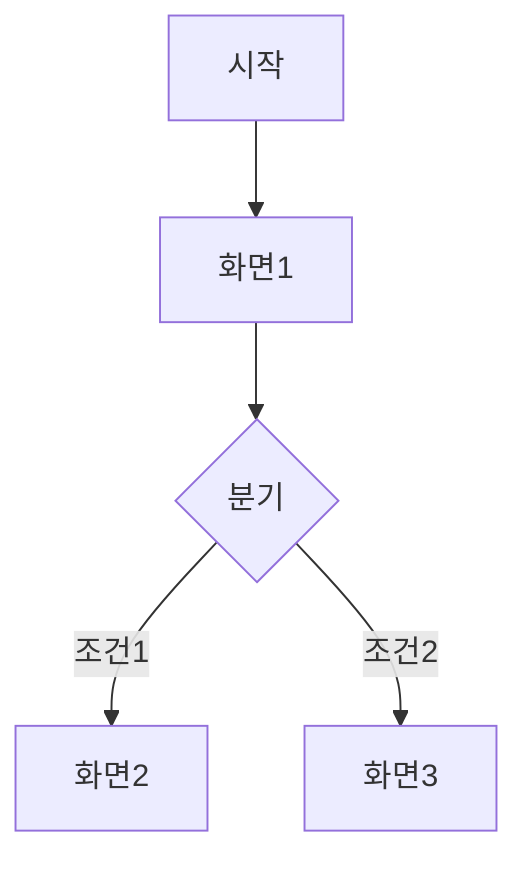

# 프로토타입 시나리오: <과업/기능명>

> 작성: `ideation-prototyper` · 상태: (Draft/검토/확정) · 최종수정: YYYY-MM-DD

## 1. 대상 · 진입점
- 사용자 과업:
- 진입점(어디서 시작):
- 전제 조건:

## 2. 화면 흐름 (Flow)

## 3. 화면별 상세
| 화면 | 목적 | 핵심 요소 | 주요 액션 | 다음 화면 |
|---|---|---|---|---|
| 화면1 | | | | |

## 4. 인터랙션 · 상태
| 화면/컴포넌트 | 빈(empty) | 로딩 | 에러 | 성공 | 비고 |
|---|---|---|---|---|---|
| | | | | | |

## 5. 미확정 · 가정
- `(TBD: …)` / `(가정: …)`

## 6. 다음 단계
- [ ] `/a11y-review` 접근성·UX 검토
- [ ] (필요 시) `/figma-sync` Figma 생성 — 사람 승인
