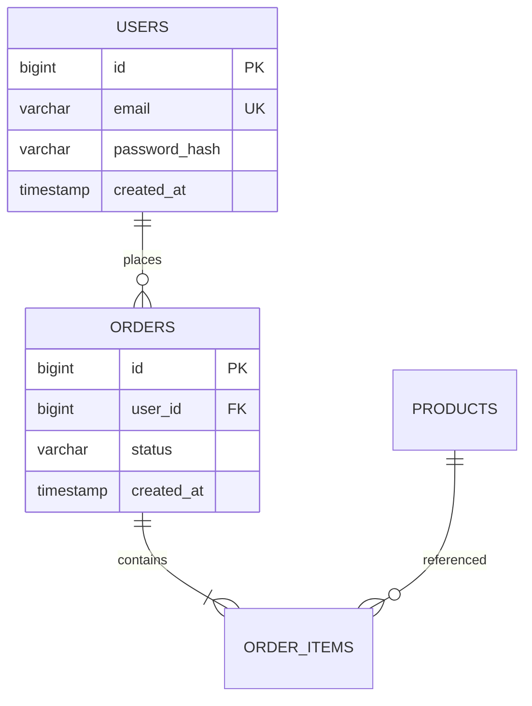

# [도메인명] DB 설계서

| 항목 | 내용 |
|---|---|
| 문서 버전 | v0.1 |
| 작성자 | (이름) |
| 작성일 | YYYY-MM-DD |
| DBMS | (예: PostgreSQL 16) |

## 1. 명명/공통 규칙
- 테이블: 영문 복수형 snake_case (예: `users`)
- 컬럼: snake_case
- 공통 컬럼: `id`(PK), `created_at`, `updated_at`
- 코드/상태값: 코드 테이블 또는 enum

## 2. ERD

## 3. 테이블 명세
> 테이블 단위로 반복.

### users (사용자)
| 컬럼 | 타입(길이) | PK | FK | NULL | 기본값 | UNIQUE | 설명 |
|---|---|---|---|---|---|---|---|
| id | bigint | ✔ | | N | auto | | 식별자 |
| email | varchar(255) | | | N | | ✔ | 로그인 ID |
| password_hash | varchar(255) | | | N | | | |
| created_at | timestamp | | | N | now() | | |

**인덱스**: `idx_users_email (email)`
**제약/관계**: `orders.user_id → users.id` (ON DELETE RESTRICT)

## 4. 코드/상태 정의
| 구분 | 코드 | 의미 |
|---|---|---|
| 주문상태 | PENDING / PAID / CANCELED | |

## 5. 정규화/비정규화 메모
- (비정규화 시 사유 기록)

## 6. 추적성
| 엔티티 | 관련 기능 ID | 관련 API ID |
|---|---|---|
| users | FN-001 | API-001 |
