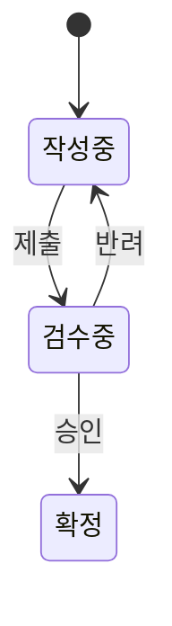

# [기능명] 기능명세서

| 항목 | 내용 |
|---|---|
| 문서 버전 | v0.1 |
| 작성자 | (이름) |
| 작성일 | YYYY-MM-DD |
| 관련 요구사항 | (FR-xxx) |

## 1. 기능 개요
- 목적 / 관련 화면(SCR-xxx) / 관련 API(API-xxx)

## 2. 기능 상세
> 기능 단위로 반복 작성.

### [기능 ID] 기능명 (예: FN-001 로그인)
| 항목 | 내용 |
|---|---|
| 연결 요구사항 | FR-001 |
| 설명 | |
| 사용자/권한 | (누가 사용 가능한가) |
| 사전조건 | |
| 입력 | (필드: 타입 / 필수 / 형식·범위) |
| 처리 규칙 | 1. … 2. … |
| 출력/결과 | (성공 시 상태·화면 변화) |
| 유효성 검증 | (입력 검증 규칙) |
| 예외/에러 | (조건 → 처리·메시지) |

#### 비즈니스 규칙
| 조건 | 결과 |
|---|---|
| | |

#### 상태 전이 (해당 시)

## 3. 추적성
| 기능 ID | 요구사항 ID | 화면 ID | API ID | TC ID |
|---|---|---|---|---|
| FN-001 | FR-001 | | | |

## 4. 미해결 이슈
- (확인 필요: …)
