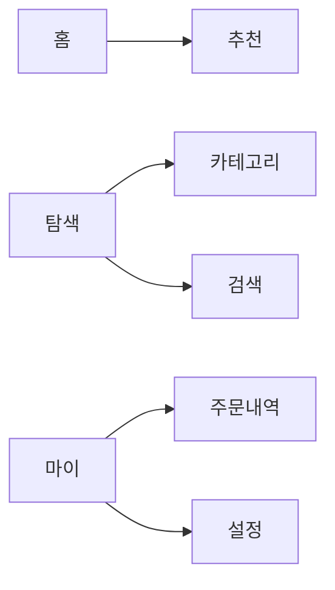

# [서비스명] 메뉴트리

| 항목 | 내용 |
|---|---|
| 문서 버전 | v0.1 |
| 작성자 | (이름) |
| 작성일 | YYYY-MM-DD |
| 관련 문서 | (IA 링크) |

## 1. 내비게이션 구조

## 2. 메뉴 상세표
| 1depth(GNB) | 2depth(LNB) | 3depth | 화면 ID | 접근 권한 | 노출 조건 |
|---|---|---|---|---|---|
| 홈 | - | - | SCR-홈-001 | 전체 | 항상 |
| 탐색 | 카테고리 | - | SCR-탐색-001 | 전체 | 항상 |
| 마이 | 주문내역 | - | SCR-마이-002 | 로그인 | 로그인 시 |

## 3. 미해결 이슈
- (확인 필요: …)
