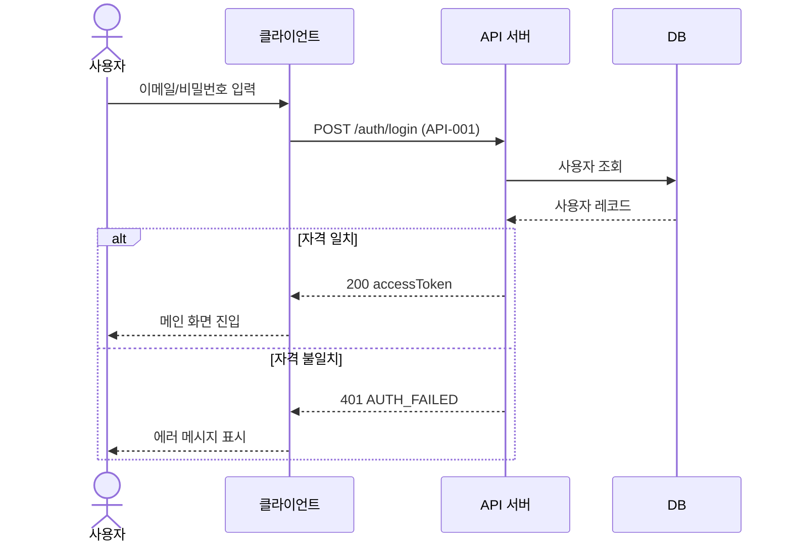

# [시나리오명] 시퀀스 다이어그램

| 항목 | 내용 |
|---|---|
| 문서 버전 | v0.1 |
| 작성자 | (이름) |
| 작성일 | YYYY-MM-DD |
| 시나리오 | (예: 로그인) |

## 1. 다이어그램

## 2. 흐름 설명
1. 사용자가 자격 정보를 입력한다.
2. 클라이언트가 로그인 API(API-001)를 호출한다.
3. 서버가 사용자 조회 후 인증 결과에 따라 분기한다.

## 3. 메시지 ↔ 명세 매핑
| 단계 | 메시지 | API/기능 ID |
|---|---|---|
| 2 | POST /auth/login | API-001 / FN-001 |

## 4. 예외/대안 흐름
- (타임아웃, 잠긴 계정 등)
