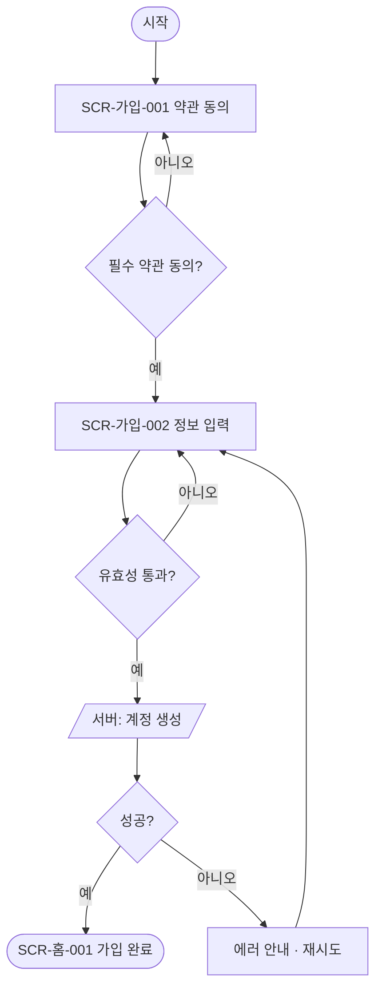

# [과업명] 유저 플로우차트

| 항목 | 내용 |
|---|---|
| 문서 버전 | v0.1 |
| 작성자 | (이름) |
| 작성일 | YYYY-MM-DD |
| 대상 과업 | (예: 회원가입) |

## 1. 흐름도

## 2. 단계 설명
| 단계 | 화면 ID | 사용자 행동 | 시스템 처리 | 분기/예외 |
|---|---|---|---|---|
| 약관 동의 | SCR-가입-001 | | | 필수 미동의 시 진행 불가 |

## 3. 이탈/예외 경로
- (네트워크 실패, 중복 가입 등)

## 4. 미해결 이슈
- (확인 필요: …)
