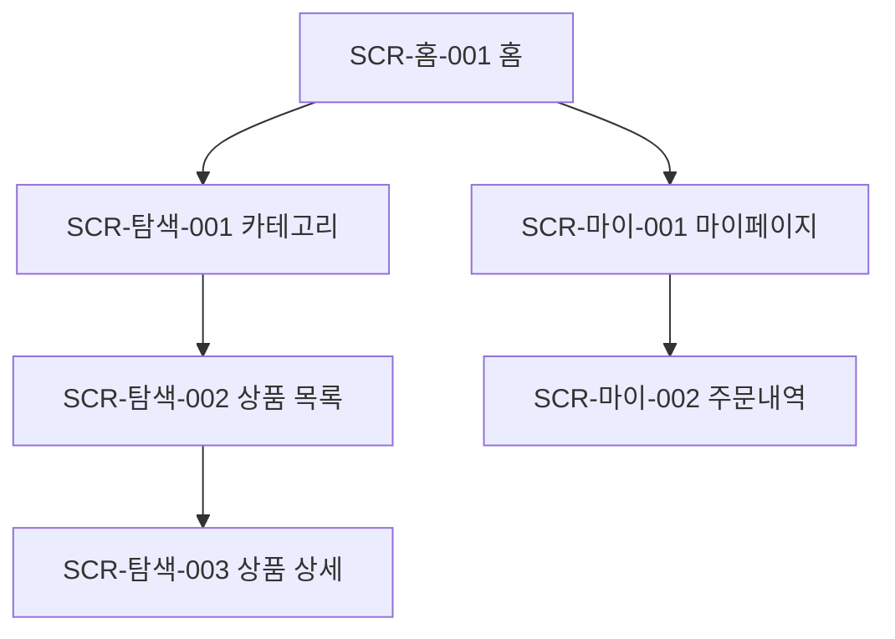

# [서비스명] 정보구조도 (IA)

| 항목 | 내용 |
|---|---|
| 문서 버전 | v0.1 |
| 작성자 | (이름) |
| 작성일 | YYYY-MM-DD |

## 1. 개요
- 대상 범위 / 화면 ID 명명 규칙 (예: `SCR-[영역]-[번호]`)

## 2. 정보 계층 구조

## 3. 화면 목록
| 화면 ID | 화면명 | Depth | 상위 | 설명 | 접근 권한 |
|---|---|---|---|---|---|
| SCR-홈-001 | 홈 | 1 | - | | 전체 |
| SCR-탐색-001 | 카테고리 | 2 | 홈 | | 전체 |

## 4. 미해결 이슈
- (확인 필요: …)
