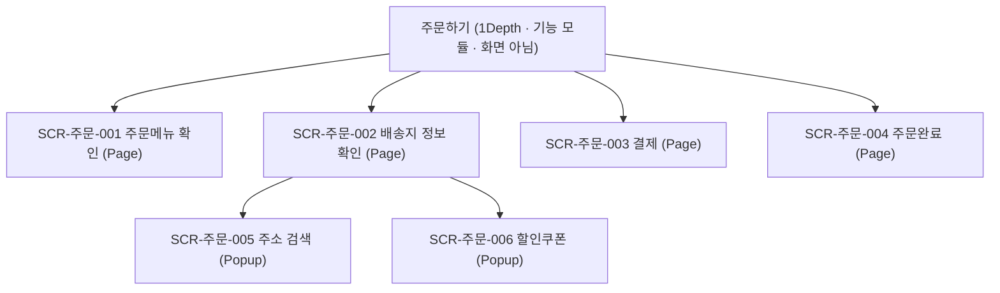

# [서비스명] 정보구조도 (IA)

| 항목 | 내용 |
|---|---|
| 문서 버전 | v0.1 |
| 작성자 | (이름) |
| 작성일 | YYYY-MM-DD |

## 1. 개요
- 대상 범위 / 화면 ID 명명 규칙 (예: `SCR-[영역]-[번호]`)

## 1-1. IA Depth 규칙 (작성 기준 — 화면 분류 시 적용)

> 이 Depth 규칙은 **IA 산출 기준**이며, 메뉴트리(`templates/메뉴트리.md`)의 GNB/LNB depth와는
> **다른 축**이다(메뉴트리는 내비게이션 관점). 혼동하지 말 것.

### 용어
| 구분 | 정의 |
|---|---|
| **1Depth** | 서비스 최상위 **기능 모듈 단위**(예: 인증·온보딩·홈·마이페이지). **화면이 아니라 기능 묶음의 이름.** |
| **2Depth** | 1Depth 모듈 안에서 사용자가 거치는 각 **Step(단계) 화면.** Step끼리는 순서가 있어도 상하관계가 아니라 **병렬** → 전부 같은 2Depth. |
| **3Depth** | 특정 2Depth 화면 **내부에서만** 열리는 하위 화면(부가기능·옵션 선택 화면). |

### Step vs Depth (핵심)
- Step은 **순서일 뿐 계층이 아니다** → Step이 많아도 같은 Depth에 나란히 둔다.
- Depth가 내려가는 경우는 **특정 Step 화면 내부에서 별도 하위 화면이 열릴 때뿐.**

### Type 분류 (모든 화면에 지정)
| Type | 정의 |
|---|---|
| **Page** | 앱 화면 자체로 제공되는 독립된 바닥 페이지(화면 전환·새 화면 로드). |
| **Popup** | 현재 화면 위에 오버레이로 열리는 화면(모달·바텀시트·토스트 포함). |

### 적용 규칙 5
1. 1Depth에는 **기능 모듈명만** 적는다(화면명 직접 금지).
2. 한 모듈 안에서 순차 진행되는 화면들은 **전부 2Depth.** "A 다음 B"라는 이유로 B를 하위 Depth로 내리지 않는다.
3. Depth를 내리는 **유일한 조건** = "특정 화면 내부에서만 접근 가능한 하위 화면이 존재할 때".
4. **Popup**은 자신을 호출한 화면보다 **한 단계 아래 Depth**에 위치한다.
5. 같은 2Depth 화면에서 열리는 Popup이 여러 개면 **전부 같은 3Depth에 나란히**(Popup끼리 상하관계 금지).

### 검증 체크리스트 5 (IA 수정 후 확인)
1. 1Depth에 화면명이 직접 들어가 있지 않은가.
2. 순차 Step을 Depth 증가로 처리한 곳이 없는가.
3. 모든 화면에 Type(Page/Popup)이 지정돼 있는가.
4. Popup이 호출 화면과 같은 Depth에 놓여 있지 않은가.
5. 화면 본수를 셀 때 1Depth 모듈명을 화면으로 카운트하고 있지 않은가.

## 2. 정보 계층 구조

> 예시: 배달의민족 "주문하기" 모듈. **1Depth 노드(`주문하기`)는 기능 모듈명이며 화면 카운트에서 제외**한다.
> 순차 Step(주문메뉴 확인→배송지→결제→주문완료)은 상하관계가 아니라 전부 2Depth 병렬이다.

## 3. 화면 목록
> `Type`은 모든 화면 행에 필수(Page/Popup). 1Depth 모듈명은 화면이 아니므로 이 표에 행으로 넣지 않는다(화면 카운트 제외).

| 화면 ID | 화면명 | Depth | Type | 상위 | 설명 | 접근 권한 |
|---|---|---|---|---|---|---|
| SCR-주문-001 | 주문메뉴 확인 | 2 | Page | 주문하기(모듈) | | 전체 |
| SCR-주문-002 | 배송지 정보 확인 | 2 | Page | 주문하기(모듈) | | 전체 |
| SCR-주문-003 | 결제 | 2 | Page | 주문하기(모듈) | | 전체 |
| SCR-주문-004 | 주문완료 | 2 | Page | 주문하기(모듈) | | 전체 |
| SCR-주문-005 | 주소 검색 | 3 | Popup | 배송지 정보 확인 | | 전체 |
| SCR-주문-006 | 할인쿠폰 | 3 | Popup | 배송지 정보 확인 | | 전체 |

## 4. 화면별 컴포넌트 인벤토리
> 목적: **이해관계자 간 누락·해석 차이를 좁힌다.** 각 화면에 보이는 **모든 컴포넌트를 빠짐없이** 나열한다
> (헤더/네비/버튼/입력필드/라벨/아이콘/이미지/리스트/카드/모달/토스트/빈상태(empty state)/로딩/에러 등).
> 화면마다 표를 반복한다.

### SCR-홈-001 홈
| # | 컴포넌트명 | 유형 | 역할/내용 | 상태(state) | 인터랙션/동작 | 데이터 바인딩·제약 |
|---|---|---|---|---|---|---|
| 1 | 상단바 | 헤더 | 로고/제목 | 기본 | 탭 시 홈 이동 | - |
| 2 | 검색 입력 | 입력필드 | 검색어 입력 | 기본/포커스/입력중/에러 | 입력→제출 시 SCR-탐색-003 | 최대 50자 |
| 3 | 상품 목록 | 리스트/카드 | 상품 카드 반복 | 기본/로딩/빈상태/에러 | 무한 스크롤 | 페이지당 20개 |

> 누락 점검 체크리스트(화면별 적용): □ 헤더/네비 □ 모든 버튼·링크 □ 입력필드·라벨 □ 아이콘·이미지
> □ 리스트·카드 □ 모달·토스트 □ 빈상태 □ 로딩 □ 에러 □ 권한 없음 상태

## 5. 미해결 이슈
- (확인 필요: …)
