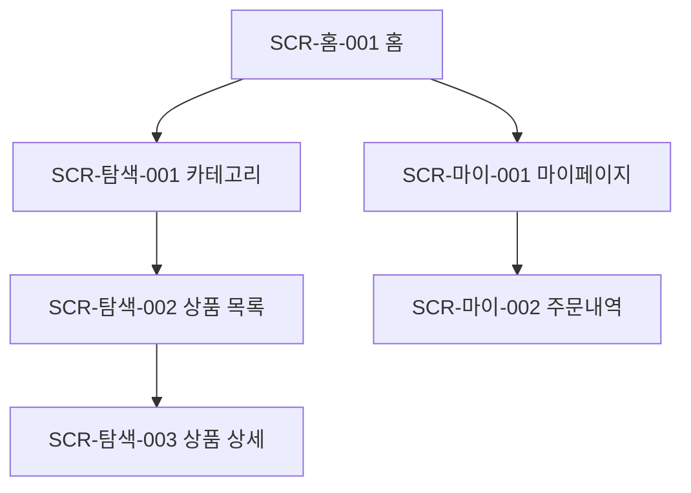

# [서비스명] 정보구조도 (IA)

| 항목 | 내용 |
|---|---|
| 문서 버전 | v0.1 |
| 작성자 | (이름) |
| 작성일 | YYYY-MM-DD |

## 1. 개요
- 대상 범위 / 화면 ID 명명 규칙 (예: `SCR-[영역]-[번호]`)

## 2. 정보 계층 구조

## 3. 화면 목록
| 화면 ID | 화면명 | Depth | 상위 | 설명 | 접근 권한 |
|---|---|---|---|---|---|
| SCR-홈-001 | 홈 | 1 | - | | 전체 |
| SCR-탐색-001 | 카테고리 | 2 | 홈 | | 전체 |

## 4. 화면별 컴포넌트 인벤토리
> 목적: **이해관계자 간 누락·해석 차이를 좁힌다.** 각 화면에 보이는 **모든 컴포넌트를 빠짐없이** 나열한다
> (헤더/네비/버튼/입력필드/라벨/아이콘/이미지/리스트/카드/모달/토스트/빈상태(empty state)/로딩/에러 등).
> 화면마다 표를 반복한다.

### SCR-홈-001 홈
| # | 컴포넌트명 | 유형 | 역할/내용 | 상태(state) | 인터랙션/동작 | 데이터 바인딩·제약 |
|---|---|---|---|---|---|---|
| 1 | 상단바 | 헤더 | 로고/제목 | 기본 | 탭 시 홈 이동 | - |
| 2 | 검색 입력 | 입력필드 | 검색어 입력 | 기본/포커스/입력중/에러 | 입력→제출 시 SCR-탐색-003 | 최대 50자 |
| 3 | 상품 목록 | 리스트/카드 | 상품 카드 반복 | 기본/로딩/빈상태/에러 | 무한 스크롤 | 페이지당 20개 |

> 누락 점검 체크리스트(화면별 적용): □ 헤더/네비 □ 모든 버튼·링크 □ 입력필드·라벨 □ 아이콘·이미지
> □ 리스트·카드 □ 모달·토스트 □ 빈상태 □ 로딩 □ 에러 □ 권한 없음 상태

## 5. 미해결 이슈
- (확인 필요: …)
